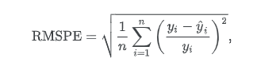

This Project is part of ITI AI and ML 9-month diploma: time series final project
# Overview
This project addresses a Kaggle time series forecasting problem. The objective is to predict future values based on historical data using both statistical and machine learning approaches. The final model is evaluated using the competition’s official metric and submitted to Kaggle.
# Project Structure
```.
├── data/                      # Raw, processed, and external datasets
├── notebooks/                 # Jupyter notebooks for analysis and modeling
├── src/                       # Python modules for preprocessing, modeling, etc.
├── outputs/                   # Saved plots, models, and submissions
├── requirements.txt           # List of Python dependencies
├── kaggle_score.txt           # Final Kaggle submission score
└── README.md                  # Project summary 
```


# Description
Rossmann operates over 3,000 drug stores in 7 European countries. Currently, Rossmann store managers are tasked with predicting their daily sales for up to six weeks in advance. Store sales are influenced by many factors, including promotions, competition, school and state holidays, seasonality, and locality. With thousands of individual managers predicting sales based on their unique circumstances, the accuracy of results can be quite varied.

Rossmann is challenging you to predict **6 weeks of daily sales** for **1,115 stores** located across Germany
[kaggel dataset](https://www.kaggle.com/competitions/rossmann-store-sales/data) 

## Dataset
| Field                        | Description |
|-----------------------------|-------------|
| **Id**                      | An Id that represents a (Store, Date) duple within the test set. |
| **Store**                   | A unique Id for each store. |
| **Sales**                   | The turnover for any given day (this is what you are predicting). |
| **Customers**               | The number of customers on a given day. |
| **Open**                    | Indicator for whether the store was open: `0 = closed`, `1 = open`. |
| **StateHoliday**            | Indicates a state holiday: `a = public holiday`, `b = Easter holiday`, `c = Christmas`, `0 = None`. Most stores are closed on state holidays. |
| **SchoolHoliday**           | Indicates if the (Store, Date) was affected by public school closures. |
| **StoreType**               | Differentiates between 4 different store models: `a`, `b`, `c`, `d`. |
| **Assortment**              | Describes assortment level: `a = basic`, `b = extra`, `c = extended`. |
| **CompetitionDistance**     | Distance in meters to the nearest competitor store. |
| **CompetitionOpenSinceMonth / Year** | Approximate month and year when the nearest competitor was opened. |
| **Promo**                   | Indicates whether a store is running a promo on that day. |
| **Promo2**                  | Indicates if the store is part of a continuous promotion: `0 = not participating`, `1 = participating`. |
| **Promo2SinceYear / Week**  | The year and calendar week when the store started participating in Promo2. |
| **PromoInterval**           | Months when Promo2 promotions start, e.g., `"Feb,May,Aug,Nov"` means rounds start in those months. |

# Objectives:

1. Perform Analysis of the data related to this competition
2. Apply simple Forecasting models and use the same evaluation from the competition.
3. Apply ETS models (not all models explained, the one that you can see is suitable)
4. Apply the Arima model
5. Apply Prophet
6. Apply any machine learning of your choice
7. Choose the best among them and perform future forecasting on the test set and submit on Kaggle.
   
# Models used
| Model Type | Description                     |
| ---------- | ------------------------------- |
| Baseline   | Mean, Naïve, Moving Average     |
| ETS        | Simple, Holt, or Holt-Winters   |
| ARIMA      | Auto ARIMA                      |
| Prophet    | Additive model with seasonality |
| ML Model   | e.g., XGBoost, Random Forest    |


# Evaluation
Submissions are evaluated on the Root Mean Square Percentage Error (RMSPE). The RMSPE is calculated as



where $y_i$ denotes the sales of a single store on a single day and $yhat_i$ denotes the corresponding prediction. Any day and store with 0 sales is ignored in scoring.

# Final Results
| Model Type | Description                     |
| ---------- | ------------------------------- |
| Baseline   | Mean, Naïve, Moving Average     |
| ETS        | Simple, Holt, or Holt-Winters   |
| ARIMA      | Auto ARIMA                      |
| Prophet    | Additive model with seasonality |
| ML Model   | e.g., XGBoost, Random Forest    |
- plots will be found in /outputs
- [kaggel submittion]()
# Notes
This Project is part of ITI AI and ML 9-month diploma: time series final project


